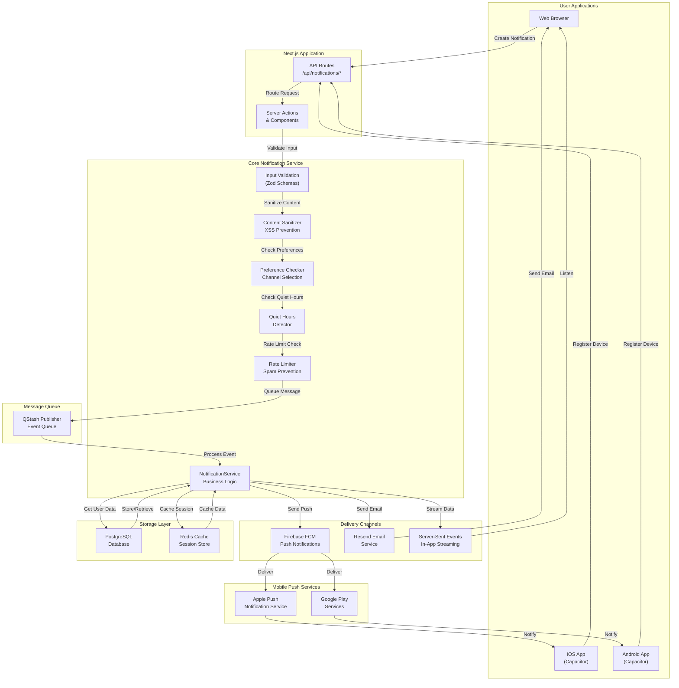
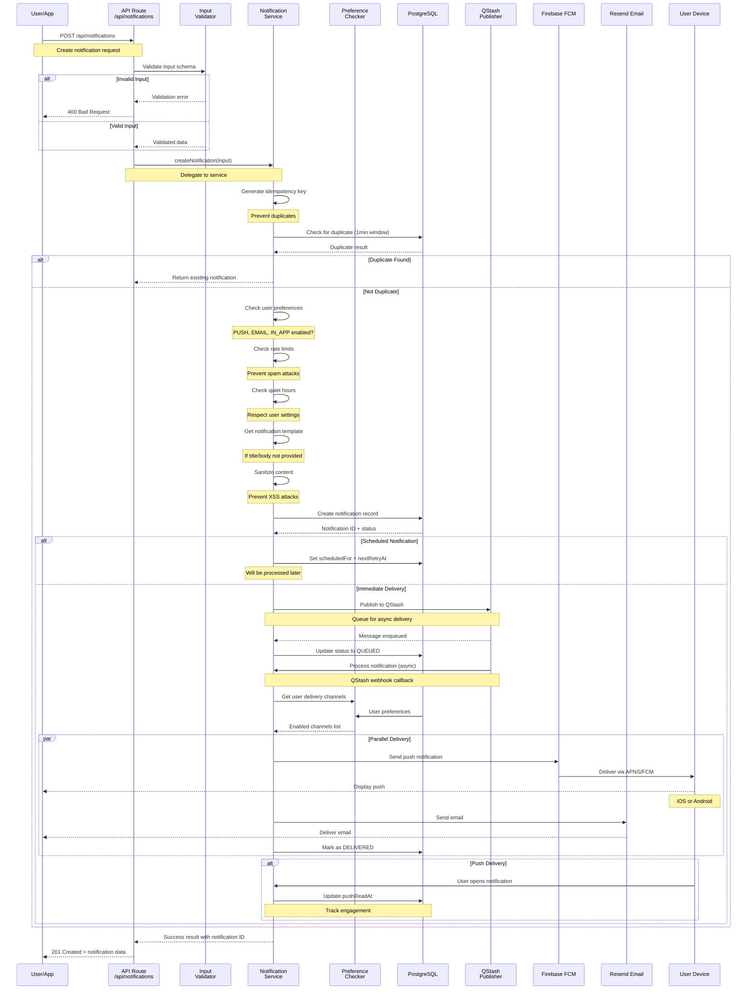
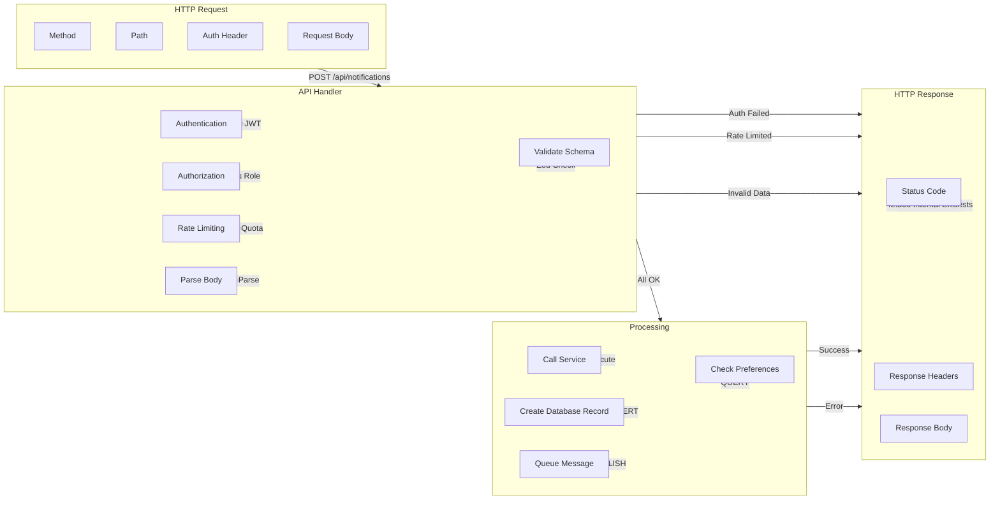
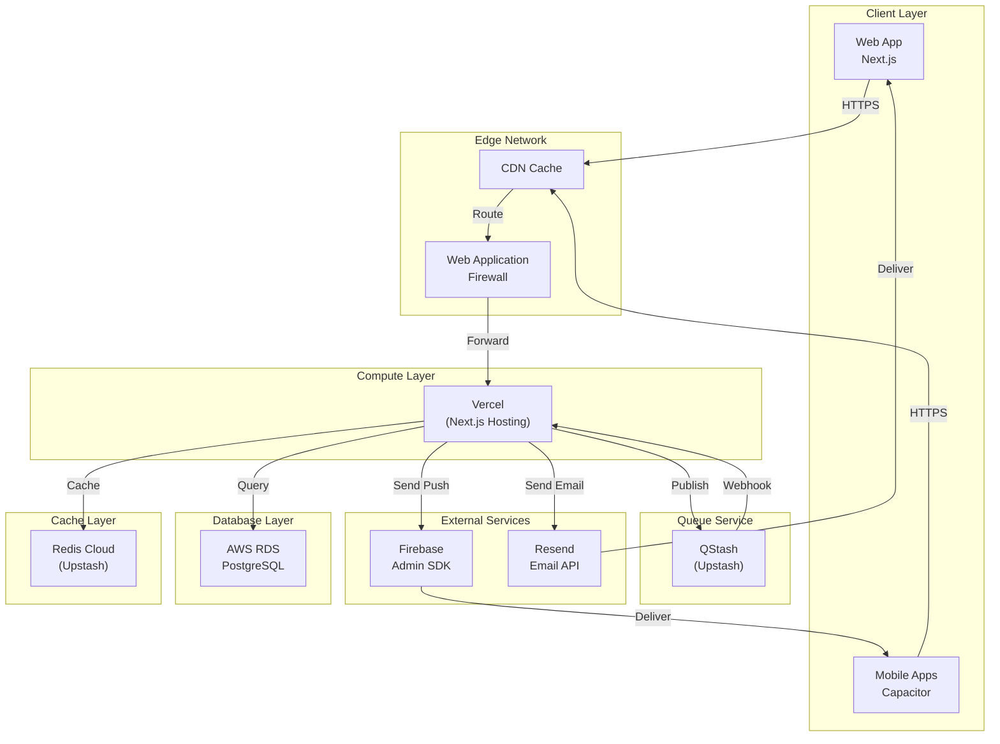

# Notification System Architecture Diagrams

This document provides comprehensive visual representations of the Massava notification system architecture using Mermaid diagrams. These diagrams illustrate the system components, data flow, interactions, and data models.

---

## 1. System Overview Diagram (C4 Container Model)

This diagram shows the high-level architecture of the notification system with key components and external services.



### Component Descriptions

**User Applications**
- **Web Browser**: Desktop/mobile web interface with real-time notification stream via SSE
- **iOS App**: Native iOS application using Capacitor for push notifications
- **Android App**: Native Android application using Capacitor for push notifications

**Next.js Layer**
- **API Routes**: RESTful endpoints at `/api/notifications/*` for all notification operations
- **Server Actions**: Server-side mutation handlers for creating, updating, and reading notifications

**Core Notification Service**
- **NotificationService**: Main business logic orchestrator managing the complete notification lifecycle
- **Input Validation**: Zod schemas validating all incoming data
- **Content Sanitizer**: XSS prevention and content sanitization
- **Preference Checker**: Determines enabled delivery channels based on user preferences
- **Quiet Hours**: Respects user quiet hours settings
- **Rate Limiter**: Prevents notification spam and abuse

**Message Queue**
- **QStash**: Upstash QStash service for reliable async message processing

**Delivery Channels**
- **Firebase FCM**: Google's Firebase Cloud Messaging for push notifications
- **Resend Email**: Email delivery service for email notifications
- **Server-Sent Events**: Real-time in-app notifications via HTTP streaming

**Storage Layer**
- **PostgreSQL**: Primary database storing all notification data and user preferences
- **Redis**: Session caching and rate limiting state

**Mobile Push Services**
- **APNS**: Apple Push Notification service (iOS)
- **Google Play Services**: Google's push notification service (Android)

---

## 2. Notification Flow Diagram (Sequence)

This diagram illustrates the complete flow from notification creation through delivery and status tracking.



### Flow Steps Explained

1. **Request Reception**: User/app sends notification creation request to API
2. **Input Validation**: Zod schema validates all parameters
3. **Duplicate Detection**: Check if identical notification sent within 1 minute (idempotency)
4. **Preference Checking**: Determine which channels (PUSH, EMAIL, IN_APP) are enabled
5. **Rate Limiting**: Verify user hasn't exceeded notification quota
6. **Quiet Hours**: Check if notification should be delayed until quiet hours end
7. **Template Resolution**: Use template if title/body not provided
8. **Content Sanitization**: Remove XSS vectors and malicious content
9. **Database Storage**: Create notification record with PENDING status
10. **Queue Publishing**: Publish to QStash for reliable async processing
11. **Channel Delivery**: Send via enabled channels in parallel
12. **Status Tracking**: Update delivery status and timestamps

---

## 3. Component Architecture Diagram

This diagram shows the internal structure of the notification system with all modules and their relationships.

```mermaid
graph TB
    subgraph API["API Layer"]
        NotifRoute["GET /api/notifications<br/>POST /api/notifications"]
        DeviceRoute["POST /api/notifications/devices<br/>DELETE /api/notifications/devices/:id"]
        PrefRoute["GET /api/notifications/preferences<br/>PUT /api/notifications/preferences"]
        ReadRoute["POST /api/notifications/:id/read<br/>POST /api/notifications/read-all"]
        UnreadRoute["GET /api/notifications/unread-count"]
        StreamRoute["GET /api/notifications/stream"]
        CronRoute["POST /api/cron/notifications"]
    end

    subgraph Service["Core Service Layer"]
        NS["NotificationService"]
        NTpl["NotificationTemplates"]
    end

    subgraph Utils["Utility Functions"]
        Idempotency["idempotency.ts<br/>Generate & validate keys"]
        PrefChecker["preference-checker.ts<br/>Channel selection"]
        QuietHours["quiet-hours.ts<br/>Hour comparison"]
        RateLimiter["rate-limiter.ts<br/>Token bucket"]
        TokenValidator["token-validator.ts<br/>Device token validation"]
        Sanitizer["sanitizer.ts<br/>XSS prevention"]
        JsonHelpers["json-helpers.ts<br/>JSON parsing"]
        MetadataGuards["metadata-guards.ts<br/>Type guards"]
    end

    subgraph Validation["Validation Layer"]
        NotifSchema["notification.schema.ts<br/>Zod schemas"]
    end

    subgraph Push["Push Services"]
        FCM["Firebase Client<br/>fcm-service.ts"]
        FCMAdmin["Firebase Admin<br/>firebase-admin.ts"]
        Capacitor["Capacitor Service<br/>push-service.ts"]
    end

    subgraph Store["Frontend State"]
        NotifStore["notification-store.ts<br/>Zustand store"]
    end

    subgraph Queue["Queue Layer"]
        QStash["QStash Publisher<br/>qstash-publisher.ts"]
    end

    subgraph DB["Data Layer"]
        Prisma["Prisma Client"]
        PG["PostgreSQL"]
    end

    NotifRoute -->|HTTP Request| NS
    DeviceRoute -->|HTTP Request| NS
    PrefRoute -->|HTTP Request| NS
    ReadRoute -->|HTTP Request| NS
    UnreadRoute -->|HTTP Request| NS
    StreamRoute -->|HTTP Request| NS

    NS -->|Validate| NotifSchema
    NS -->|Template| NTpl
    NS -->|Check Duplicate| Idempotency
    NS -->|Get Preferences| PrefChecker
    NS -->|Check Hours| QuietHours
    NS -->|Check Limits| RateLimiter
    NS -->|Validate Token| TokenValidator
    NS -->|Sanitize| Sanitizer
    NS -->|Parse JSON| JsonHelpers
    NS -->|Type Guard| MetadataGuards

    NS -->|Publish Event| QStash
    NS -->|Query Data| Prisma

    FCM -->|Push| FCMAdmin
    Capacitor -->|Register Token| NS

    NotifStore -->|Update State| NS

    Prisma -->|Query| PG
    Prisma -->|Write| PG
```



### Module Organization

**API Layer** (`/app/api/notifications/*`)
- Handles HTTP requests for all notification operations
- Manages authentication and authorization
- Applies rate limiting and caching
- Routes to service layer

**Core Service Layer** (`/lib/notifications/`)
- `notification-service.ts`: Main orchestrator for all business logic
- `notification-templates.ts`: Template rendering for common notification types
- `notification-types.ts`: Type definitions and constants
- `errors.ts`: Error types and factory functions
- `notification-metadata.ts`: Metadata validation utilities

**Utilities** (`/lib/notifications/utils/`)
- Idempotency: Prevents duplicate notifications
- Preference Checker: Determines enabled delivery channels
- Quiet Hours: Time-based notification suppression
- Rate Limiter: Token bucket algorithm for spam prevention
- Token Validator: Validates and verifies device tokens
- Sanitizer: XSS prevention and content sanitization
- JSON Helpers: Safe JSON parsing with error handling
- Metadata Guards: Type-safe metadata validation

**Validation Layer** (`/lib/schemas/`)
- `notification.schema.ts`: Zod validation schemas for all inputs

**Push Services** (`/lib/firebase/` and `/lib/capacitor/`)
- Firebase Client: Client-side FCM integration
- Firebase Admin: Server-side FCM push delivery
- Capacitor Service: Mobile device token registration

**Frontend State** (`/stores/`)
- `notification-store.ts`: Zustand store for notification UI state

**Queue Layer** (`/lib/queue/`)
- QStash Publisher: Publishes events to Upstash QStash for async processing

**Data Layer** (`/lib/db/`)
- Prisma Client: ORM for database operations
- PostgreSQL: Primary data store

---

## 4. Data Model Diagram (ERD)

This diagram shows the complete data schema for the notification system.

```mermaid
erDiagram
    USER ||--o{ NOTIFICATION : creates
    USER ||--o{ DEVICE_TOKEN : registers
    USER ||--|| NOTIFICATION_PREFERENCE : has
    NOTIFICATION ||--o{ NOTIFICATION_CHANNEL : sends
    NOTIFICATION_CHANNEL ||--o{ DELIVERY_STATUS : tracks

    USER {
        string id PK
        string email UK
        string name
        datetime created_at
        datetime updated_at
    }

    NOTIFICATION {
        string id PK
        string user_id FK
        string type
        string title
        string body
        json metadata
        string status
        json status_history
        datetime scheduled_for
        datetime expires_at
        datetime push_delivered_at
        datetime push_read_at
        datetime push_failed_at
        string push_error
        datetime email_sent_at
        datetime email_opened_at
        datetime email_failed_at
        string email_error
        datetime in_app_seen_at
        int retry_count
        int max_retries
        datetime last_retry_at
        datetime next_retry_at
        string idempotency_key UK
        datetime created_at
        datetime updated_at
    }

    NOTIFICATION_CHANNEL {
        string id PK
        string notification_id FK
        string channel
        string status
        json metadata
        datetime sent_at
        datetime delivered_at
        datetime failed_at
        string failure_reason
        datetime created_at
    }

    DELIVERY_STATUS {
        string id PK
        string channel_id FK
        string status
        string reason
        json error_details
        datetime timestamp
    }

    DEVICE_TOKEN {
        string id PK
        string user_id FK
        string token UK
        string platform
        string device_name
        string device_model
        string app_version
        string os_version
        boolean is_active
        datetime last_used_at
        int failure_count
        datetime last_failure_at
        string last_failure_reason
        datetime created_at
        datetime updated_at
    }

    NOTIFICATION_PREFERENCE {
        string id PK
        string user_id FK UK
        boolean push_enabled
        boolean email_enabled
        boolean in_app_enabled
        boolean quiet_hours_enabled
        string quiet_hours_start
        string quiet_hours_end
        string timezone
        json type_preferences
        boolean email_digest_enabled
        string digest_frequency
        string digest_time
        string language
        datetime created_at
        datetime updated_at
    }
```

### Data Model Details

**USER Table**
- Core user data (linked from main User service)
- One-to-many relationship with Notification and DeviceToken
- One-to-one relationship with NotificationPreference

**NOTIFICATION Table**
- Stores all notification records with complete lifecycle tracking
- Tracks delivery status per channel (push, email, in-app)
- Maintains status history as JSON for audit trail
- Supports retry logic with max retries and next retry timestamp
- Idempotency key for duplicate detection
- Scheduling support with `scheduledFor` and expiration with `expiresAt`

**NOTIFICATION_CHANNEL Table**
- Tracks delivery status per channel
- One notification can have multiple channel records
- Records timing for each delivery stage (sent, delivered, failed)
- Stores channel-specific metadata and failure reasons

**DELIVERY_STATUS Table**
- Historical tracking of status changes per channel
- Enables audit trail and debugging of delivery issues
- Stores detailed error information

**DEVICE_TOKEN Table**
- Registers mobile device tokens for push notifications
- Platform-specific (iOS/Android)
- Tracks device metadata for analytics
- Monitors token health (failure count, last failure)
- Marks inactive tokens for cleanup

**NOTIFICATION_PREFERENCE Table**
- User-specific notification settings
- Per-channel enable/disable flags
- Quiet hours configuration (start/end times and timezone)
- Type-based preferences as JSON for granular control
- Email digest settings with frequency and preferred time
- Language preference for localization

### Indexes and Performance

Key indexes for common queries:
```sql
-- Device tokens
CREATE INDEX idx_device_token_user_id ON device_tokens(user_id);
CREATE INDEX idx_device_token_user_active ON device_tokens(user_id, is_active);
CREATE INDEX idx_device_token_platform ON device_tokens(platform);
CREATE INDEX idx_device_token_last_used ON device_tokens(last_used_at);

-- Notifications
CREATE UNIQUE INDEX idx_notification_idempotency ON notifications(idempotency_key);
CREATE INDEX idx_notification_user_id ON notifications(user_id);
CREATE INDEX idx_notification_status ON notifications(status);
CREATE INDEX idx_notification_scheduled ON notifications(scheduled_for);
CREATE INDEX idx_notification_next_retry ON notifications(next_retry_at);

-- Notification channels
CREATE INDEX idx_notification_channel_id ON notification_channels(notification_id);
CREATE INDEX idx_notification_channel_status ON notification_channels(status);
```

---

## 5. Request-Response Flow Diagram

This diagram shows the complete HTTP request/response cycle for the main notification operations.



---

## 6. Technology Stack Summary

### Backend Services
- **Next.js 14+**: App Router with Server Actions
- **Fastify** (future): Microservice for intensive notification processing
- **Node.js**: Runtime environment

### Validation & Security
- **Zod**: Schema validation for all inputs
- **XSS Prevention**: DOMPurify-based sanitization
- **Rate Limiting**: Token bucket algorithm
- **CSRF Protection**: Built into Next.js Server Actions

### Database & Cache
- **PostgreSQL**: Primary data store
- **Prisma ORM**: Type-safe database queries
- **Redis**: Session and cache storage

### Message Queue
- **QStash** (Upstash): Serverless queue for reliable async processing
- **Webhook Callbacks**: For processing notifications asynchronously

### Push Notification Services
- **Firebase Cloud Messaging (FCM)**: iOS, Android, Web push
- **Apple Push Notification Service (APNS)**: Direct iOS delivery
- **Google Play Services**: Direct Android delivery

### Email Service
- **Resend**: Email delivery provider

### Frontend
- **React 18+**: UI library
- **Zustand**: State management
- **Capacitor**: Cross-platform mobile framework
- **TypeScript**: Type safety

### Monitoring & Observability
- **Logger**: Structured logging for debugging
- **Error Tracking**: Correlation IDs for tracing
- **Status History**: JSON audit trail of all status changes

---

## 7. Security & Reliability Features

### Security
- **Input Validation**: All inputs validated against Zod schemas
- **XSS Prevention**: Content sanitization before storage
- **Rate Limiting**: Token bucket to prevent abuse
- **Authentication**: JWT-based with role authorization
- **Idempotency**: Prevents duplicate notifications from retries

### Reliability
- **Message Queue**: Guaranteed delivery via QStash
- **Retry Logic**: Exponential backoff for failed deliveries
- **Status Tracking**: Complete audit trail of every notification
- **Duplicate Detection**: 1-minute window to prevent duplicates
- **Graceful Degradation**: Continues delivery even if one channel fails

### Performance
- **Async Processing**: QStash for non-blocking operations
- **Caching**: Redis for frequently accessed preferences
- **Database Indexes**: Optimized for common queries
- **Batch Processing**: Cron jobs for cleanup and scheduled notifications

---

## 8. Deployment Architecture



---

## References

- **API Documentation**: See `API_QUICK_REFERENCE.md` for detailed endpoint documentation
- **Implementation Guide**: See `03-backend-services.md` for service implementation details
- **Database Schema**: See `02-database-schema.md` for complete schema documentation
- **Frontend Components**: See `05-frontend-components.md` for UI component documentation
- **Testing Strategy**: See `07-testing-strategy.md` for test coverage and examples

---

Last Updated: December 2, 2025
